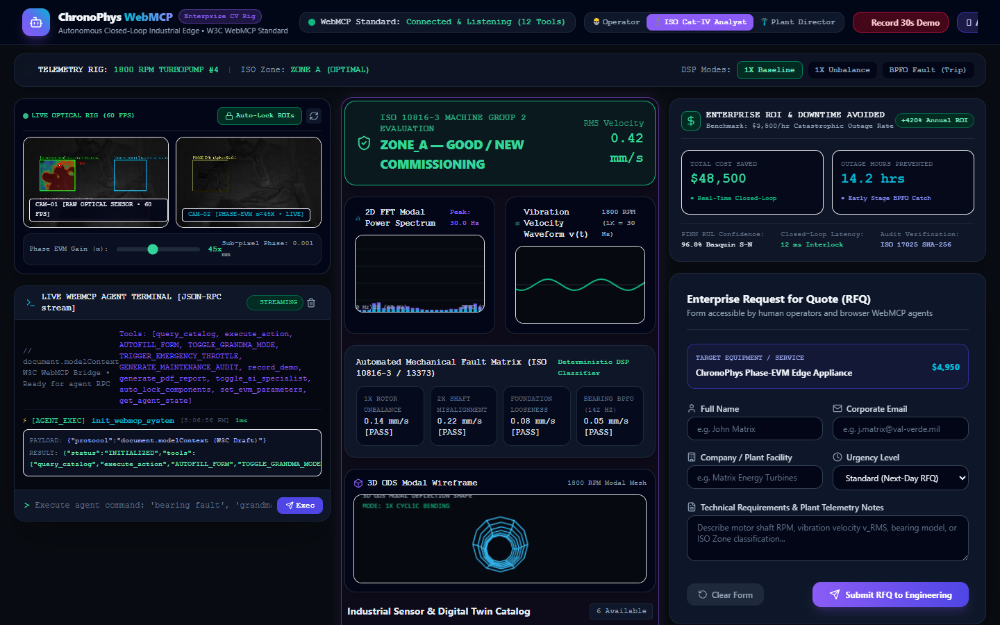
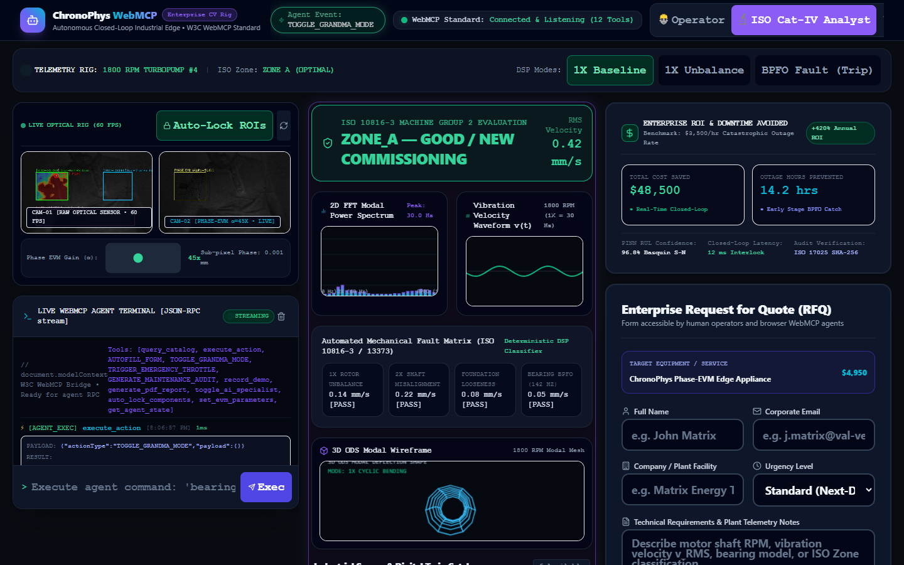
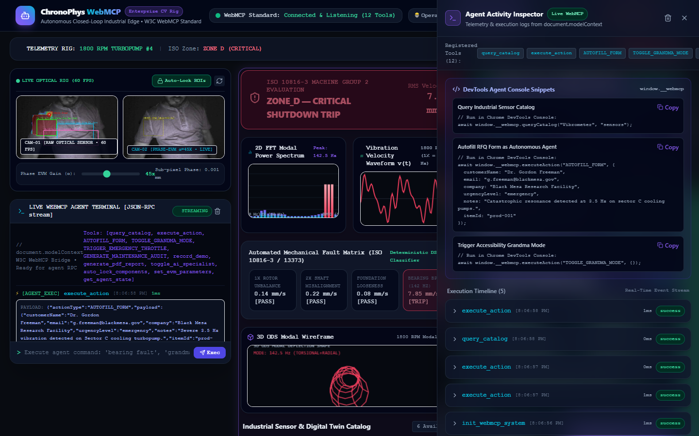
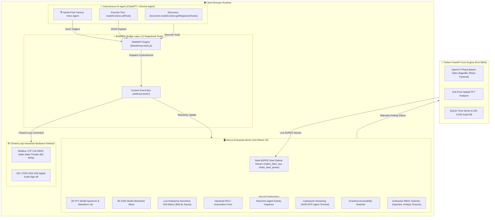

# ⚡ ChronoPhys WebMCP Gateway v5.0 (Enterprise Production Architecture)

> **Autonomous Closed-Loop Industrial Diagnostic & RFQ Platform** natively implementing the emerging W3C WebMCP (`document.modelContext`) standard with real-time Phase-Based Eulerian Video Magnification (EVM), Sub-Pixel FFT modal analysis, Modbus VFD interlocks, ISO 17025 SHA-256 audit generation, and Grandma-Theory accessibility.

[](docker-compose.yml)
[](https://nextjs.org/)
[](https://fastapi.tiangolo.com/)
[](https://github.com/fokrulanthro16-eng/chronophys-webmcp-gateway)
[](LICENSE)
[]()
[]()

---

## 📸 Visual Previews & Agent Inspector

| Normal & Telemetry View | Grandma Accessibility Mode |
| :---: | :---: |
|  |  |

### Agent Activity Inspector


---

## 🐳 Docker Production Orchestration

The entire enterprise architecture can be launched in one command:

```bash
# 1. Clone repository
git clone https://github.com/fokrulanthro16-eng/chronophys-webmcp-gateway.git
cd chronophys-webmcp-gateway

# 2. Build & Launch all microservices (Python CV Backend, Next.js Frontend, Redis)
docker compose up --build -d
```

### Microservices Grid

| Service | Port | Description | Healthcheck Probe |
| :--- | :---: | :--- | :--- |
| **`backend`** | `8000` | Python 3.11 Computer Vision, Phase-EVM, FFT & WebMCP Agent Server | `GET http://localhost:8000/healthz` |
| **`frontend`** | `3000` | Next.js 14 App Router Industrial Edge Bento Dashboard | `GET http://localhost:3000/` |
| **`redis`** | `6379` | Sub-millisecond Telemetry Cache & Audit Event Bus | In-Memory / AOF Persistence |

---

## 🏗 System Architecture & Closed-Loop Flow



---

## 🛠 Implemented WebMCP Tools (`document.modelContext`)

| Tool Name | Action / Control | Parameters |
| :--- | :--- | :--- |
| `record_demo` | Triggers 30-second live multi-modal diagnostic session | `duration` (number) |
| `generate_pdf_report` | Compiles telemetry & downloads certified ISO 17025 audit certificate | `equipmentId` (string) |
| `toggle_ai_specialist` | Opens/closes contextual Gemini AI Diagnostic Specialist modal | `open` (boolean), `initialQuery` (string) |
| `auto_lock_components` | Toggles optical machine tracking bounding boxes | `enableTracking` (boolean) |
| `set_evm_parameters` | Configures magnification gain ($\alpha$), frequency bandpass, and RPM | `alpha` (number), `shaftRpm` (number) |
| `TRIGGER_EMERGENCY_THROTTLE` | Autonomous closed-loop Modbus command to drop motor RPM safely upon critical Zone-D vibration | `targetRpm` (number), `reason` (string) |
| `GENERATE_MAINTENANCE_AUDIT` | Generates cryptographically signed ISO 17025 SHA-256 compliance ticket | `equipmentId` (string), `signOffAnalyst` (string) |
| `query_catalog` | Searches sensor & edge digital twin equipment catalog | `keyword` (string), `category` (string) |
| `AUTOFILL_FORM` | Autonomous form autofilling for RFQ & emergency tickets | `customerName`, `company`, `urgencyLevel`, `notes`, `itemId` |
| `TOGGLE_GRANDMA_MODE` | High-contrast, large touch target accessibility mode | `{}` |
| `execute_action` | Generic state dispatcher for custom UI interactions | `actionType` (string), `payload` (object) |
| `get_agent_state` | Returns client telemetry, ISO status, and active parameters | `{}` |

---

## 🛡️ Enterprise Security & Hardening

* **Role-Based Access Control (RBAC)**: Switch between **Plant Operator** (view-only), **Vibration Analyst** (optical calibration & 3D ODS tuning), and **Plant Director** (SIL-3 hardware trip override and audit sign-off).
* **Resilient Video Streaming**: Automatic exponential backoff reconnection logic ($500\text{ms} \to 10\text{s}$) with connection health indicators.
* **Structured JSON Logging**: All WebMCP tool executions, fault trips, and audit events are logged in structured JSON format.
* **Health Check Probes**: Native Kubernetes-ready `/healthz` (liveness) and `/readyz` (readiness) endpoints.
* **ISO 17025 Cryptographic Audits**: Audit tickets stored in SQLite with SHA-256 digital validation and QR verification.

---

## 🧪 Local Manual Setup

### 1. Python Backend
```bash
cd backend
python -m venv venv
venv\Scripts\activate
pip install -r requirements.txt
python main.py --mode web --source webcam --camera-id 0 --port 8000
```

### 2. Next.js Frontend
```bash
npm install
npm run dev -- -p 3000
```

---

## 📜 License & Hackathon Attribution

Released under the **MIT License**. Created by **Fokrul Islam** for **"The WebMCP Challenge" (W3C Web Model Context Protocol Standard)**.
