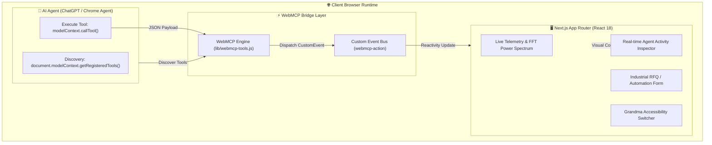

# ⚡ ChronoPhys WebMCP Gateway

> **An Agent-Ready Industrial Diagnostic & RFQ Platform** natively implementing the emerging W3C WebMCP (`document.modelContext`) standard with Grandma-Theory accessibility.

[](https://nextjs.org/)
[](https://github.com/fokrulanthro16-eng/chronophys-webmcp-gateway)
[](LICENSE)
[]()

---

## 💡 The Problem & The WebMCP Solution

* **Traditional AI Web Automation:** Brittle DOM scraping, random CSS selector lookups, slow visual parsing, and high failure rates on complex industrial dashboards.
* **The WebMCP Paradigm:** Instead of guessing UI elements, the web application explicitly registers structured tools using `document.modelContext`. AI agents (like ChatGPT browser and Chrome Agent) execute deterministic API calls, directly mutating state and reading machine telemetry safely.

---

## 🏗 System Architecture



---

## 🛠 Implemented WebMCP Tools

| Tool Name | Description | Key Input Schema Parameters |
| :--- | :--- | :--- |
| `query_catalog` | Fetches components, sensors, and machine metrics | `keyword` (string), `category` (string), `maxResults` (number) |
| `AUTOFILL_FORM` | Autonomous form fill for RFQ tickets & diagnostics | `customerName`, `company`, `urgencyLevel`, `notes`, `itemId` |
| `TOGGLE_GRANDMA_MODE` | Activates high-contrast, large-target accessibility mode | `{}` |
| `execute_action` | Generic state dispatcher for custom UI interactions | `actionType` (string), `payload` (object) |
| `get_agent_state` | Returns the current client telemetry & UI state to agent | `{}` |

---

## 👵 Grandma-Theory Accessibility Mode

Engineered to remove friction for non-technical users and domain operators:
* **Ultra-high contrast color palette** for zero visual strain.
* **Generously spaced click targets** and clear visual telemetry indicators.
* **Dual-mode operation**: complete manual fallback alongside AI autonomous agent execution.

---

## 🧪 Local Testing & Verification

### 1. Enable WebMCP testing in Google Chrome:
1. Navigate to `chrome://flags/#enable-webmcp-testing`
2. Set the flag to **Enabled** and relaunch Chrome.

### 2. Clone & run locally:

```bash
git clone https://github.com/fokrulanthro16-eng/chronophys-webmcp-gateway.git
cd chronophys-webmcp-gateway
npm install
npm run dev
```

### 3. Open `http://localhost:3000` and open Chrome DevTools (`F12` -> Console).

### 4. Run agent test commands:

```javascript
// 1. Inspect registered tools
console.log(document.modelContext.getRegisteredTools());

// 2. Trigger Autonomous RFQ Form Filling
await window.__webmcp.executeAction("AUTOFILL_FORM", {
  customerName: "Dr. Gordon Freeman",
  email: "g.freeman@blackmesa.gov",
  company: "Black Mesa Research Facility",
  urgencyLevel: "emergency",
  notes: "Severe 3.5 Hz vibration detected on Sector C cooling turbopump.",
  itemId: "prod-001"
});

// 3. Toggle Accessibility Mode
await window.__webmcp.executeAction("TOGGLE_GRANDMA_MODE", {});
```

---

## 🏆 Devpost Submission Summary

* **Track:** The WebMCP Challenge (OpenAI & Devpost)
* **Standard:** W3C `document.modelContext` Tool Registration
* **Live Deployment:** Supported on Vercel, Cloudflare, and Render
