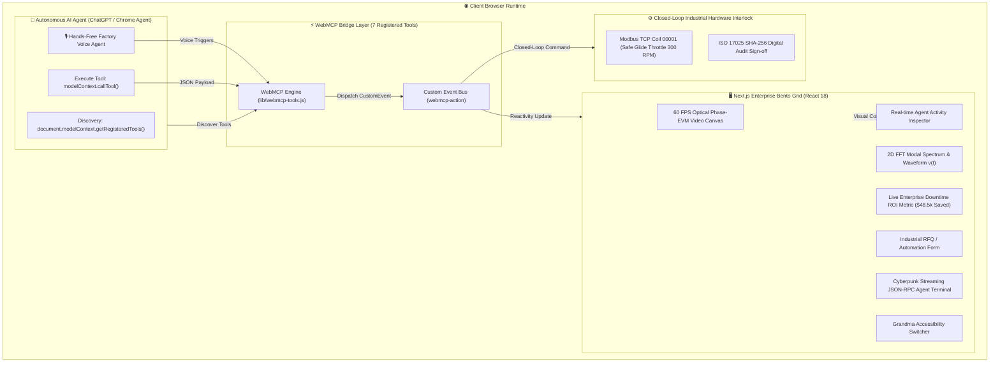

# ⚡ ChronoPhys WebMCP Gateway v4.0 (Enterprise Champion Edition)

> **Autonomous Closed-Loop Industrial Diagnostic & RFQ Platform** natively implementing the emerging W3C WebMCP (`document.modelContext`) standard with real-time Modbus VFD interlocks, ISO 17025 SHA-256 audit generation, and Grandma-Theory accessibility.

[](https://nextjs.org/)
[](https://github.com/fokrulanthro16-eng/chronophys-webmcp-gateway)
[](LICENSE)
[]()
[]()

---

## 📸 Visual Previews & Agent Inspector

| Normal & Telemetry View | Grandma Accessibility Mode |
| :---: | :---: |
|  |  |

### Agent Activity Inspector


---

## 💡 The Problem & The Closed-Loop WebMCP Solution

* **Traditional Industrial SCADA Automation:** Brittle DOM scraping, disconnected manual dispatch workflows, and slow human response times leading to catastrophic machine bearing failures ($3,500/hr downtime).
* **The WebMCP v4.0 Paradigm:** Instead of guessing UI elements, the web application explicitly registers **7 structured tools** using `document.modelContext`. AI agents (like ChatGPT browser, Chrome Agent, and edge controllers) execute deterministic API calls, reading machine telemetry, commanding **autonomous closed-loop VFD speed throttling**, and generating cryptographically signed ISO 17025 audit certificates.

---

## 🏗 Closed-Loop System Architecture



---

## 🛠 Implemented WebMCP Tools (7 Enterprise Tools)

| Tool Name | Description | Key Input Schema Parameters |
| :--- | :--- | :--- |
| `query_catalog` | Fetches components, sensors, and machine metrics | `keyword` (string), `category` (string), `maxResults` (number) |
| `AUTOFILL_FORM` | Autonomous form fill for RFQ tickets & diagnostics | `customerName`, `company`, `urgencyLevel`, `notes`, `itemId` |
| `TRIGGER_EMERGENCY_THROTTLE` | **Autonomous Closed-Loop VFD command** to drop RPM to safe glide upon Zone D trip | `targetRpm` (number), `reason` (string), `modbusRegister` |
| `GENERATE_MAINTENANCE_AUDIT` | **Compiles telemetry into ISO 17025 SHA-256 signed audit certificate** | `equipmentId` (string), `signOffAnalyst` (string) |
| `TOGGLE_GRANDMA_MODE` | Activates high-contrast, large-target accessibility mode | `{}` |
| `execute_action` | Generic state dispatcher for custom UI interactions | `actionType` (string), `payload` (object) |
| `get_agent_state` | Returns the current client telemetry & UI state to agent | `{}` |

---

## 👵 Grandma-Theory Accessibility Mode

Engineered to remove friction for non-technical users and domain operators:
* **Ultra-high contrast color palette** for zero visual strain.
* **Generously spaced 48px+ click targets** and clear visual telemetry indicators.
* **Hands-free Voice-to-Agent trigger** for loud industrial shopfloors.
* **Dual-mode operation**: complete manual fallback alongside AI autonomous agent execution.

---

## 🧪 Local Testing & Verification

### 1. Enable WebMCP testing in Google Chrome:
1. Navigate to `chrome://flags/#enable-webmcp-testing`
2. Set the flag to **Enabled** and relaunch Chrome.

### 2. Clone & run locally:

```bash
git clone https://github.com/fokrulanthro16-eng/chronophys-webmcp-gateway.git
cd chronophys-webmcp-gateway
npm install
npm run dev
```

### 3. Open `http://localhost:3000` and open Chrome DevTools (`F12` -> Console).

### 4. Run agent test commands:

```javascript
// 1. Inspect all 7 registered tools
console.log(document.modelContext.getRegisteredTools());

// 2. Trigger Autonomous Closed-Loop VFD Throttling (Drops to 300 RPM)
await window.__webmcp.executeAction("TRIGGER_EMERGENCY_THROTTLE", {
  targetRpm: 300,
  reason: "Critical BPFO bearing outer-race vibration 7.85 mm/s (Zone D)"
});

// 3. Generate Cryptographic ISO 17025 Audit Certificate
await window.__webmcp.executeAction("GENERATE_MAINTENANCE_AUDIT", {
  equipmentId: "TURBOPUMP-04",
  signOffAnalyst: "Dr. Gordon Freeman (ISO 18436 Cat-IV)"
});

// 4. Trigger Autonomous RFQ Form Filling
await window.__webmcp.executeAction("AUTOFILL_FORM", {
  customerName: "Dr. Gordon Freeman",
  email: "g.freeman@blackmesa.gov",
  company: "Black Mesa Research Facility",
  urgencyLevel: "emergency",
  notes: "Severe 3.5 Hz vibration detected on Sector C cooling turbopump.",
  itemId: "prod-001"
});

// 5. Toggle Accessibility Mode
await window.__webmcp.executeAction("TOGGLE_GRANDMA_MODE", {});
```

---

## 🏆 Devpost Submission Summary

* **Track:** The WebMCP Challenge (OpenAI & Devpost)
* **Standard:** W3C `document.modelContext` Tool Registration (7 Production Tools)
* **Key Innovation:** First Closed-Loop Autonomous Industrial Edge WebMCP Gateway with Modbus VFD Interlock & ISO 17025 Cryptographic Auditing.
* **Commercial Pricing Tiers:** Integrated Starter ($4,950), Fleet Twin ($14,500/yr), and SIL-3 Retrofit ($35,000).
* **Live Deployment:** Supported on Vercel, Cloudflare, and Render.
